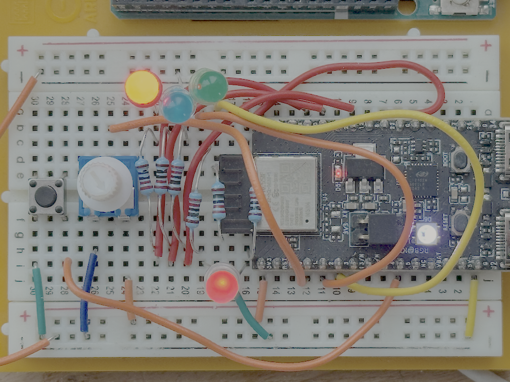

# colorRed & co. research

Some research on embedded swift on esp32h2, based on available examples. Fun (sometimes not)

## Requirements

- working esp.idf and embedded swift toolchain, esp32h2 tested
  
## What works at once?

- ADCConverter - for knobs, needs some tweaks.

- GPIOHandler - for buttons (I'm not sure).

- RGBLed - pure rainbow available.

## What not

- LedStrip, because it disturb others.
